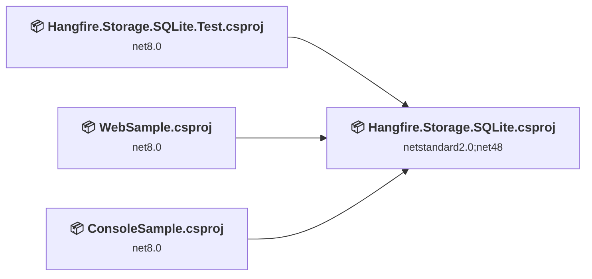
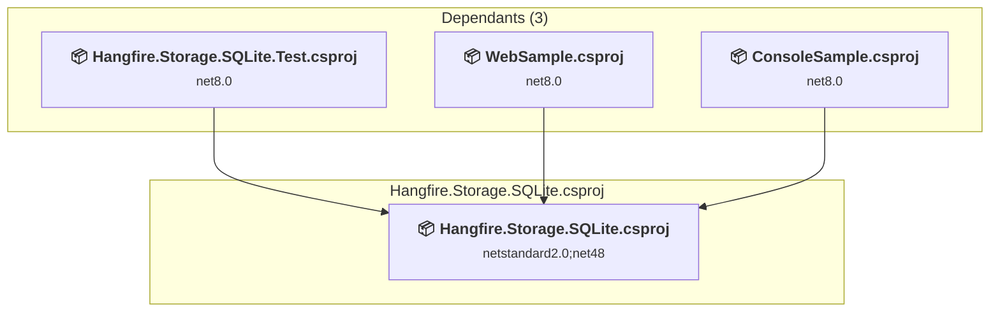
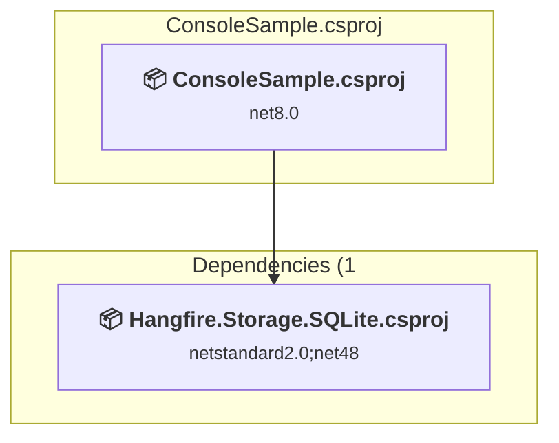
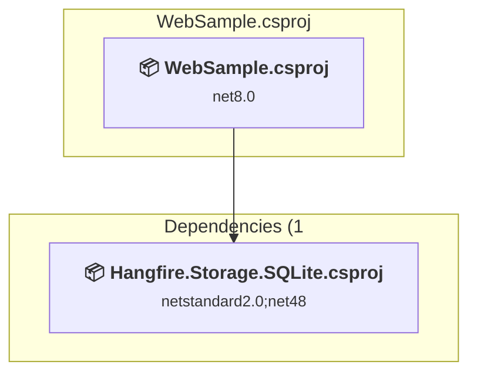
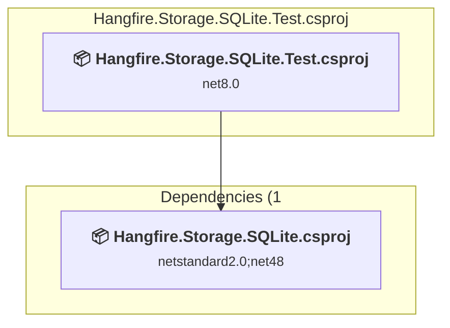

# Projects and dependencies analysis

This document provides a comprehensive overview of the projects and their dependencies in the context of upgrading to .NETCoreApp,Version=v10.0.

## Table of Contents

- [Executive Summary](#executive-Summary)
  - [Highlevel Metrics](#highlevel-metrics)
  - [Projects Compatibility](#projects-compatibility)
  - [Package Compatibility](#package-compatibility)
  - [API Compatibility](#api-compatibility)
  - [Binding Redirect Configuration](#binding-redirect-configuration)
- [Aggregate NuGet packages details](#aggregate-nuget-packages-details)
- [Top API Migration Challenges](#top-api-migration-challenges)
  - [Technologies and Features](#technologies-and-features)
  - [Most Frequent API Issues](#most-frequent-api-issues)
- [Projects Relationship Graph](#projects-relationship-graph)
- [Project Details](#project-details)

  - [src\main\Hangfire.Storage.SQLite\Hangfire.Storage.SQLite.csproj](#srcmainhangfirestoragesqlitehangfirestoragesqlitecsproj)
  - [src\samples\ConsoleSample\ConsoleSample.csproj](#srcsamplesconsolesampleconsolesamplecsproj)
  - [src\samples\WebSample\WebSample.csproj](#srcsampleswebsamplewebsamplecsproj)
  - [src\test\Hangfire.Storage.SQLite.Test\Hangfire.Storage.SQLite.Test.csproj](#srctesthangfirestoragesqlitetesthangfirestoragesqlitetestcsproj)

## Executive Summary

### Highlevel Metrics

| Metric | Count | Status |
| :--- | :---: | :--- |
| Total Projects | 4 | All require upgrade |
| Total NuGet Packages | 15 | All compatible |
| Total Code Files | 51 |  |
| Total Code Files with Incidents | 17 |  |
| Total Lines of Code | 8131 |  |
| Total Number of Issues | 64 |  |
| Estimated LOC to modify | 60+ | at least 0,7% of codebase |

### Projects Compatibility

| Project | Target Framework | Difficulty | Package Issues | API Issues | Binding Issues | Est. LOC Impact | Description |
| :--- | :---: | :---: | :---: | :---: | :---: | :---: | :--- |
| [src\main\Hangfire.Storage.SQLite\Hangfire.Storage.SQLite.csproj](#srcmainhangfirestoragesqlitehangfirestoragesqlitecsproj) | netstandard2.0;net48 | 🟢 Low | 0 | 18 | 0 | 18+ | ClassLibrary, Sdk Style = True |
| [src\samples\ConsoleSample\ConsoleSample.csproj](#srcsamplesconsolesampleconsolesamplecsproj) | net8.0 | 🟢 Low | 0 | 0 | 0 |  | DotNetCoreApp, Sdk Style = True |
| [src\samples\WebSample\WebSample.csproj](#srcsampleswebsamplewebsamplecsproj) | net8.0 | 🟢 Low | 0 | 2 | 0 | 2+ | AspNetCore, Sdk Style = True |
| [src\test\Hangfire.Storage.SQLite.Test\Hangfire.Storage.SQLite.Test.csproj](#srctesthangfirestoragesqlitetesthangfirestoragesqlitetestcsproj) | net8.0 | 🟢 Low | 0 | 40 | 0 | 40+ | DotNetCoreApp, Sdk Style = True |

### Package Compatibility

| Status | Count | Percentage |
| :--- | :---: | :---: |
| ✅ Compatible | 15 | 100,0% |
| ⚠️ Incompatible | 0 | 0,0% |
| 🔄 Upgrade Recommended | 0 | 0,0% |
| ***Total NuGet Packages*** | ***15*** | ***100%*** |

### API Compatibility

| Category | Count | Impact |
| :--- | :---: | :--- |
| 🔴 Binary Incompatible | 0 | High - Require code changes |
| 🟡 Source Incompatible | 60 | Medium - Needs re-compilation and potential conflicting API error fixing |
| 🔵 Behavioral change | 0 | Low - Behavioral changes that may require testing at runtime |
| ✅ Compatible | 8850 |  |
| ***Total APIs Analyzed*** | ***8910*** |  |

## Aggregate NuGet packages details

| Package | Current Version | Suggested Version | Projects | Description |
| :--- | :---: | :---: | :--- | :--- |
| coverlet.collector | 10.0.1 |  | [Hangfire.Storage.SQLite.Test.csproj](#srctesthangfirestoragesqlitetesthangfirestoragesqlitetestcsproj) | ✅Compatible |
| Hangfire | 1.8.23 |  | [WebSample.csproj](#srcsampleswebsamplewebsamplecsproj) | ✅Compatible |
| Hangfire.Core | 1.8.23 |  | [Hangfire.Storage.SQLite.csproj](#srcmainhangfirestoragesqlitehangfirestoragesqlitecsproj) | ✅Compatible |
| Hangfire.Heartbeat | 0.6.0 |  | [WebSample.csproj](#srcsampleswebsamplewebsamplecsproj) | ✅Compatible |
| Hangfire.JobsLogger | 0.2.1 |  | [WebSample.csproj](#srcsampleswebsamplewebsamplecsproj) | ✅Compatible |
| Microsoft.NET.Test.Sdk | 18.7.0 |  | [Hangfire.Storage.SQLite.Test.csproj](#srctesthangfirestoragesqlitetesthangfirestoragesqlitetestcsproj) | ✅Compatible |
| Moq | 4.20.72 |  | [Hangfire.Storage.SQLite.Test.csproj](#srctesthangfirestoragesqlitetesthangfirestoragesqlitetestcsproj) | ✅Compatible |
| NETStandard.Library | 2.0.3 |  | [Hangfire.Storage.SQLite.csproj](#srcmainhangfirestoragesqlitehangfirestoragesqlitecsproj) | ✅Compatible |
| Newtonsoft.Json | 13.0.4 |  | [Hangfire.Storage.SQLite.csproj](#srcmainhangfirestoragesqlitehangfirestoragesqlitecsproj) [WebSample.csproj](#srcsampleswebsamplewebsamplecsproj) | ✅Compatible |
| sqlite-net-pcl | 1.9.172 |  | [Hangfire.Storage.SQLite.csproj](#srcmainhangfirestoragesqlitehangfirestoragesqlitecsproj) | ✅Compatible |
| SQLitePCLRaw.bundle_e_sqlite3 | 3.0.3 |  | [Hangfire.Storage.SQLite.csproj](#srcmainhangfirestoragesqlitehangfirestoragesqlitecsproj) | ✅Compatible |
| SQLitePCLRaw.provider.dynamic_cdecl | 3.0.3 |  | [Hangfire.Storage.SQLite.Test.csproj](#srctesthangfirestoragesqlitetesthangfirestoragesqlitetestcsproj) | ✅Compatible |
| xunit.runner.visualstudio | 3.1.5 |  | [Hangfire.Storage.SQLite.Test.csproj](#srctesthangfirestoragesqlitetesthangfirestoragesqlitetestcsproj) | ✅Compatible |
| Xunit.SkippableFact | 1.5.61 |  | [Hangfire.Storage.SQLite.Test.csproj](#srctesthangfirestoragesqlitetesthangfirestoragesqlitetestcsproj) | ✅Compatible |
| xunit.v3 | 3.2.2 |  | [Hangfire.Storage.SQLite.Test.csproj](#srctesthangfirestoragesqlitetesthangfirestoragesqlitetestcsproj) | ✅Compatible |

## Top API Migration Challenges

### Technologies and Features

| Technology | Issues | Percentage | Migration Path |
| :--- | :---: | :---: | :--- |

### Most Frequent API Issues

| API | Count | Percentage | Category |
| :--- | :---: | :---: | :--- |
| M:System.TimeSpan.FromSeconds(System.Double) | 33 | 55,0% | Source Incompatible |
| M:System.TimeSpan.FromMinutes(System.Double) | 12 | 20,0% | Source Incompatible |
| M:System.TimeSpan.FromDays(System.Double) | 7 | 11,7% | Source Incompatible |
| M:System.TimeSpan.FromHours(System.Double) | 5 | 8,3% | Source Incompatible |
| M:System.TimeSpan.FromMilliseconds(System.Double) | 3 | 5,0% | Source Incompatible |

## Projects Relationship Graph

Legend:
📦 SDK-style project
⚙️ Classic project

## Project Details

### src\main\Hangfire.Storage.SQLite\Hangfire.Storage.SQLite.csproj

#### Project Info

- **Current Target Framework:** netstandard2.0;net48
- **Proposed Target Framework:** netstandard2.0;net48;net10.0
- **SDK-style**: True
- **Project Kind:** ClassLibrary
- **Dependencies**: 0
- **Dependants**: 3
- **Number of Files**: 38
- **Number of Files with Incidents**: 6
- **Lines of Code**: 4032
- **Estimated LOC to modify**: 18+ (at least 0,4% of the project)

#### Dependency Graph

Legend:
📦 SDK-style project
⚙️ Classic project

### API Compatibility

| Category | Count | Impact |
| :--- | :---: | :--- |
| 🔴 Binary Incompatible | 0 | High - Require code changes |
| 🟡 Source Incompatible | 18 | Medium - Needs re-compilation and potential conflicting API error fixing |
| 🔵 Behavioral change | 0 | Low - Behavioral changes that may require testing at runtime |
| ✅ Compatible | 4038 |  |
| ***Total APIs Analyzed*** | ***4056*** |  |

### src\samples\ConsoleSample\ConsoleSample.csproj

#### Project Info

- **Current Target Framework:** net8.0
- **Proposed Target Framework:** net10.0
- **SDK-style**: True
- **Project Kind:** DotNetCoreApp
- **Dependencies**: 1
- **Dependants**: 0
- **Number of Files**: 1
- **Number of Files with Incidents**: 1
- **Lines of Code**: 23
- **Estimated LOC to modify**: 0+ (at least 0,0% of the project)

#### Dependency Graph

Legend:
📦 SDK-style project
⚙️ Classic project

### API Compatibility

| Category | Count | Impact |
| :--- | :---: | :--- |
| 🔴 Binary Incompatible | 0 | High - Require code changes |
| 🟡 Source Incompatible | 0 | Medium - Needs re-compilation and potential conflicting API error fixing |
| 🔵 Behavioral change | 0 | Low - Behavioral changes that may require testing at runtime |
| ✅ Compatible | 35 |  |
| ***Total APIs Analyzed*** | ***35*** |  |

### src\samples\WebSample\WebSample.csproj

#### Project Info

- **Current Target Framework:** net8.0
- **Proposed Target Framework:** net10.0
- **SDK-style**: True
- **Project Kind:** AspNetCore
- **Dependencies**: 1
- **Dependants**: 0
- **Number of Files**: 4
- **Number of Files with Incidents**: 2
- **Lines of Code**: 60
- **Estimated LOC to modify**: 2+ (at least 3,3% of the project)

#### Dependency Graph

Legend:
📦 SDK-style project
⚙️ Classic project

### API Compatibility

| Category | Count | Impact |
| :--- | :---: | :--- |
| 🔴 Binary Incompatible | 0 | High - Require code changes |
| 🟡 Source Incompatible | 2 | Medium - Needs re-compilation and potential conflicting API error fixing |
| 🔵 Behavioral change | 0 | Low - Behavioral changes that may require testing at runtime |
| ✅ Compatible | 117 |  |
| ***Total APIs Analyzed*** | ***119*** |  |

### src\test\Hangfire.Storage.SQLite.Test\Hangfire.Storage.SQLite.Test.csproj

#### Project Info

- **Current Target Framework:** net8.0
- **Proposed Target Framework:** net10.0
- **SDK-style**: True
- **Project Kind:** DotNetCoreApp
- **Dependencies**: 1
- **Dependants**: 0
- **Number of Files**: 12
- **Number of Files with Incidents**: 8
- **Lines of Code**: 4016
- **Estimated LOC to modify**: 40+ (at least 1,0% of the project)

#### Dependency Graph

Legend:
📦 SDK-style project
⚙️ Classic project

### API Compatibility

| Category | Count | Impact |
| :--- | :---: | :--- |
| 🔴 Binary Incompatible | 0 | High - Require code changes |
| 🟡 Source Incompatible | 40 | Medium - Needs re-compilation and potential conflicting API error fixing |
| 🔵 Behavioral change | 0 | Low - Behavioral changes that may require testing at runtime |
| ✅ Compatible | 4660 |  |
| ***Total APIs Analyzed*** | ***4700*** |  |

